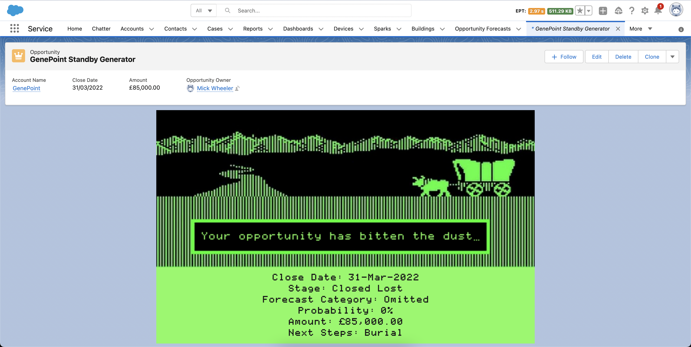
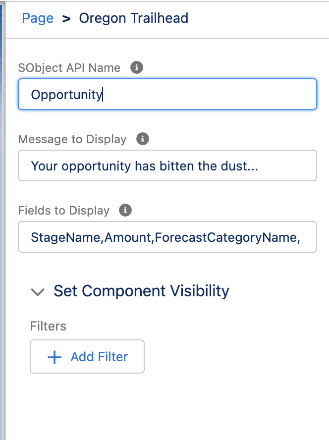

# Oregon Trailhead

A fun little LWC to show when you're opportunity has perished on the trail. 

Inspired from this twitter thread: https://twitter.com/SteveMoForce/status/1509208181708398603

## Usage

Simply add the "Oregon Trailhead" component to your Lightning Record Page!

The component is dynamic needs to be configured by specifying the following:

**SObject API Name** - The API name of the SObject the component is on (e.g "Opportunity" or "My_Custom_Object__c")

**Message** - The message to be shown on the page (e.g "Your opportunity has bitten the dust...")

**Fields to Display** - The fields to display below the image, using the API names and seperated by a comma (e.g "StageName,Amount")

You could also add filters, for example to only render the component when an Opportunity is "Closed/Lost"

## Installation

You can install this as an unmanaged package by clicking [here](https://login.salesforce.com/packaging/installPackage.apexp?p0=04t0o000003TjOG). The package ID is `04t0o000003TjOG` if you wish to install manually.

Alternatively, you can deploy this repo to your Salesforce org using SFDX by running the below commands (assuming SFDX and GIT are installed)

1. Clone the repo: `$ git clone https://github.com/mickwheelz/OregonTrailhead.git`

2. Change to the directoy containing the metadata: `$ cd OregonTrailhead`

3. Deploy the metadata: `$ sfdx force:source:deploy -u <username or alias> -p .`

## License

This software is licensed under the [MIT License](https://github.com/mickwheelz/OregonTrailhead/blob/main/LICENSE).

Font used is ["Print Char 21"](https://www.kreativekorp.com/software/fonts/apple2.shtml) by kreativekorp, under the [Free Use License](https://www.kreativekorp.com/software/fonts/FreeLicense.txt)
